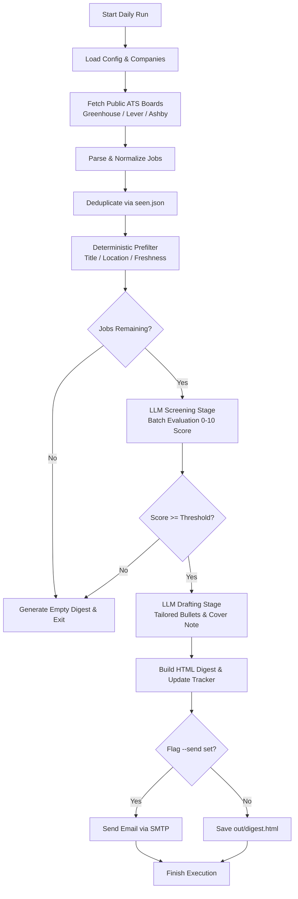

# HirePilot AI

> **Find the right engineering jobs before everyone else.**
>
> *AI-powered job intelligence for finding the right engineering opportunities.*

HirePilot AI is an automated, AI-driven job discovery and career intelligence system designed specifically for software and AI engineers. It continuously monitors public Applicant Tracking System (ATS) job boards, filters out irrelevant postings using deterministic rules, and evaluates candidate fit using Large Language Models (LLMs).

Rather than forcing users to manually browse noisy job portals or spending unnecessary API tokens processing thousands of irrelevant listings, HirePilot AI operates in two distinct stages: a zero-cost deterministic pre-filtering pipeline followed by targeted LLM screening and application kit drafting.

The system surfaces only high-confidence job opportunities, generating an actionable daily HTML digest complete with match rationale, tailored resume bullet points, honest skill gap analyses, and customizable draft cover notes. HirePilot AI never automatically submits applications; it arms candidates with the insights and materials required to submit high-quality applications themselves.

```
+-------------------+      +-------------------------+      +-------------------+      +----------------------+
|  1,300+ Raw Jobs  | ---> | Deterministic Filters   | ---> |   LLM Screening   | ---> |   HTML Email Digest  |
|  Greenhouse/Lever |      | (Title/Location/Age)    |      |  (0-10 Fit Score) |      |   + CSV Tracker      |
|  /Ashby ATS APIs  |      | [Free & Fast Pass]      |      | [Targeted AI Pass]|      | [Actionable Output]  |
+-------------------+      +-------------------------+      +-------------------+      +----------------------+
```

---

## Why HirePilot AI?

Traditional job platforms present severe challenges for active software engineering candidates:
* **Overwhelming Noise**: Commercial job boards index thousands of duplicate, outdated, or poorly targeted listings.
* **LLM Cost & Speed Bottlenecks**: Feeding raw job feeds directly into AI models is cost-prohibitive and slow.
* **Lack of Personalization**: Generic search engines rely on simple keyword matches that ignore candidate seniority, domain alignment, and tech stack match.

HirePilot AI addresses these issues directly:
1. **Zero-Token Pre-filtering**: Drops ~99% of non-matching postings via regex and deterministic metadata gates before spending a single LLM token.
2. **Precision Fit Evaluation**: Scores surviving job descriptions (0–10) against candidate profiles parsed from real resumes.
3. **Application Intelligence**: Automatically drafts role-specific resume bullet points, cover note drafts, and interview questions for top-tier matches.
4. **Stateful Deduplication & Tracking**: Records seen jobs and application statuses locally to ensure you never review the same posting twice.

---

## Core Features

### 1. ATS Job Discovery
HirePilot AI fetches open postings directly from official, unauthenticated public ATS endpoints—eliminating the need for fragile web scrapers or accounts:
* **Greenhouse API**: Fetches active job listings via `boards-api.greenhouse.io`.
* **Lever API**: Fetches postings via `api.lever.co`.
* **Ashby API**: Fetches job board data via `api.ashbyhq.com`.

Target companies and their respective ATS slugs are configurable in [`companies.yaml`](companies.yaml).

### 2. Deterministic Pre-Filtering
Before executing AI evaluations, job listings pass through a fast, cost-free filtering stage configured in [`config.yaml`](config.yaml):
* **Title Regex Inclusion & Exclusion**: Matches job titles against regex patterns (e.g., matching backend, full-stack, AI, systems roles while excluding senior management, internships, or irrelevant disciplines).
* **Location Gate**: Filters by target cities or regions (e.g., Bengaluru, Hyderabad, India).
* **Remote Role Support**: Passes postings marked as remote even if the primary location differs.
* **Freshness Threshold (`max_age_days`)**: Excludes stale job listings older than a specified number of days.

### 3. AI Candidate Screening & Fit Scoring
Jobs passing pre-filters are evaluated by an LLM against the candidate's [`profile.json`](profile.json):
* **Batch Processing**: Groups job descriptions into batches (`screen_batch_size`) for optimal throughput and reduced latency.
* **Context Truncation**: Truncates raw HTML job descriptions to essential text (`screen_jd_chars`) to control token consumption.
* **Fit Scoring (0.0–10.0)**: Scores candidates on genuine match quality and filters out listings below `score_threshold` (default `7.0`).

### 4. Application Kit Drafting
For jobs clearing the match score threshold, a high-tier LLM stage generates a custom application kit:
* **Fit Summary**: Concise breakdown of why the candidate is a strong match.
* **Tailored Resume Bullets**: Role-specific experience highlights ready to drop into a resume.
* **Honest Skill Gaps**: Highlights missing requirements or experience gaps to prepare for interviews.
* **Draft Cover Note**: Personalized introductory message for hiring managers.
* **Interview Questions**: Candidate-to-interviewer questions tailored to the company's stack and role requirements.

### 5. HTML Job Digest & Email Delivery
* **Inline HTML Digest**: Builds a clean, responsive HTML document (`out/digest.html`) formatted specifically for desktop and mobile email clients.
* **SMTP Email Delivery**: When invoked with `--send`, transmits the daily digest via standard SMTP (e.g., Gmail with App Passwords).

### 6. Job Tracking & Deduplication
* **State Preservation (`seen.json`)**: Tracks every evaluated job ID (`{ats}:{slug}:{id}`) to guarantee zero repeated reviews across daily runs.
* **Application Lifecycle Tracking**: Mark applied jobs via CLI (`python -m hirepilot applied <job_id>`).
* **CSV Export (`out/tracker.csv`)**: Export analytics and status data for tracking in Excel or Google Sheets.

---

## Architecture

### System Execution Flow



### Project Layout

```
HirePilot-AI/
├── hirepilot/                 # Core Python package
│   ├── __init__.py           # Package initialization
│   ├── __main__.py           # CLI entrypoint module
│   ├── cli.py                # Command-line interface parser & command handlers
│   ├── fetch.py              # ATS board fetchers & HTML text normalization
│   ├── prefilter.py          # Deterministic title, location, and age filters
│   ├── providers.py          # LLM provider abstractions (Gemini, Anthropic, Groq, Ollama)
│   ├── llm.py                # Screening, drafting, and profile extraction pipelines
│   ├── digest.py             # HTML digest document builder
│   ├── mailer.py             # SMTP email delivery client
│   ├── store.py              # Deduplication store (seen.json) & CSV tracker exporter
│   └── mock.py               # Fixture generator for offline testing
├── config.yaml               # Job search filters, LLM parameters, and path settings
├── companies.yaml            # List of targeted ATS company boards
├── profile.example.json      # Sample candidate profile schema
├── profile.json              # Candidate profile (generated/edited)
├── requirements.txt          # Package dependencies
├── tests/                    # Test suite (parsers, prefilters, LLM mock tests)
│   ├── test_parsers.py
│   └── test_llm.py
├── .env.example              # Environment variables template
└── README.md                 # Documentation
```

---

## Supported LLM Providers

HirePilot AI features a swappable provider interface ([`hirepilot/providers.py`](hirepilot/providers.py)). Screening and drafting stages can use different models independently:

| Provider | Provider Key | Environment Variable | PDF Resume Parsing | Description |
| :--- | :--- | :--- | :--- | :--- |
| **Google Gemini** | `gemini` | `GEMINI_API_KEY` | Yes | Highly cost-effective; recommended default |
| **Anthropic Claude** | `anthropic` | `ANTHROPIC_API_KEY` | Yes | Uses official Anthropic SDK |
| **Groq** | `groq` | `GROQ_API_KEY` | No | Ultra-fast inference for screening |
| **OpenAI-Compatible** | `openai-compatible` | `GROQ_API_KEY` + `LLM_BASE_URL` | No | Supports OpenRouter, Together AI, vLLM |
| **Ollama** | `ollama` | None | No | Fully local LLM execution via `OLLAMA_HOST` |
| **Keyword Stub** | `--scorer keyword` | None | No | Offline token-overlap fallback for dry runs |

---

## Quickstart & Setup Guide

### 1. Clone & Setup Virtual Environment

```bash
# Clone repository
git clone https://github.com/nitesh-20/Hire-AI.git
cd Hire-AI

# Create & activate virtual environment
python3 -m venv .venv
source .venv/bin/activate    # On Windows: .venv\Scripts\Activate.ps1

# Install requirements
pip install -r requirements.txt
```

### 2. Verify Installation (Offline Mock Test)

Run the test suite and an offline mock execution without needing network access or API keys:

```bash
# Run automated tests
pytest

# Execute offline mock pipeline run
python -m hirepilot run --mock --scorer keyword
```

Open `out/digest.html` in your browser to view the generated sample digest.

---

## Configuration & Usage

### 1. Configure Environment Credentials

Create a `.env` file from `.env.example`:

```bash
cp .env.example .env
```

Edit `.env` to supply your credentials:

```env
LLM_PROVIDER=gemini
GEMINI_API_KEY=your_gemini_api_key_here
SCREEN_MODEL=gemini-3.5-flash-lite
DRAFT_MODEL=gemini-3.6-flash

# Email configuration (Optional, for --send)
SMTP_HOST=smtp.gmail.com
SMTP_PORT=587
SMTP_USER=your_email@gmail.com
SMTP_PASS=your_gmail_app_password
MAIL_TO=your_email@gmail.com
```

### 2. Build Candidate Profile

Generate your `profile.json` directly from your resume (`.pdf`, `.txt`, or `.md`):

```bash
python -m hirepilot profile --resume path/to/your_resume.pdf
```

Review and customize the generated `profile.json` file.

### 3. Customize Company Boards & Filters

* Edit [`companies.yaml`](companies.yaml) to target specific company ATS boards:
  ```yaml
  companies:
    - {ats: greenhouse, slug: razorpaysoftwareprivatelimited, name: Razorpay}
    - {ats: lever, slug: cred, name: CRED}
    - {ats: ashby, slug: openai, name: OpenAI}
  ```
* Edit [`config.yaml`](config.yaml) to adjust target experience parameters (`min_years: 0`, `max_years: 2`, `internships: true`, `new_grad: true`), job title regex patterns, target locations, max posting age, and LLM score thresholds:
  ```yaml
  target_experience:
    min_years: 0
    max_years: 2
    internships: true
    new_grad: true
    entry_level: true
  ```

---

## Command Reference

### Execute Daily Pipeline

```bash
# Run pipeline with a limit of 10 jobs (Cost guard for initial testing)
python -m hirepilot run --limit 10

# Run full pipeline and output to out/digest.html
python -m hirepilot run

# Run full pipeline and send HTML digest via SMTP email
python -m hirepilot run --send

# Run screening pass only (Skip kit drafting stage to save tokens)
python -m hirepilot run --no-draft
```

### Track Applications & View Analytics

```bash
# Mark a job ID as applied
python -m hirepilot applied "lever:cred:123456"

# Print tracking analytics and export out/tracker.csv
python -m hirepilot stats
```


